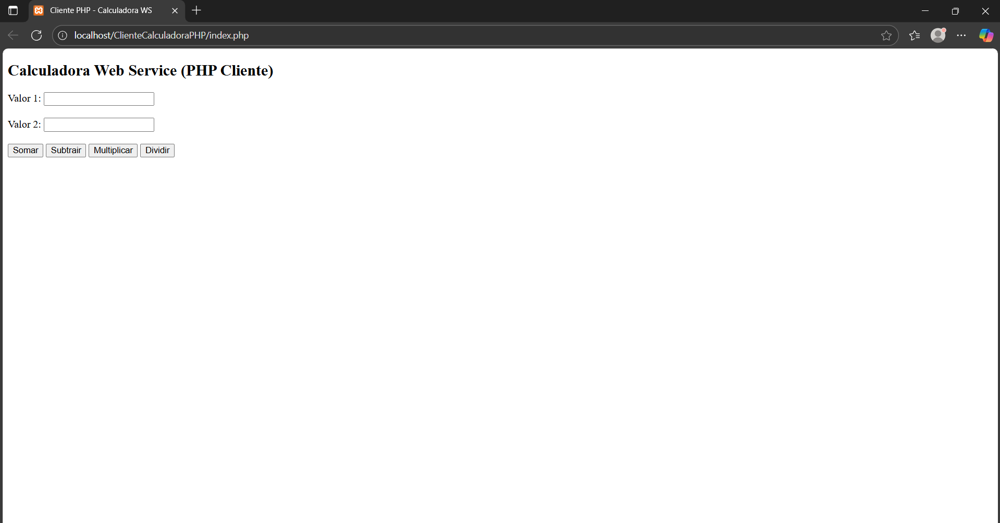

# 📘 Exercício 4 – Cliente PHP consumindo Web Service de Calculadora (baseado nos Exercícios 1 e 2)

## 🔎 Descrição
Este exercício tem como objetivo criar um **cliente em PHP** que consome o **Web Service SOAP da Calculadora**, desenvolvido anteriormente nos **Exercícios 1 e 2**.  
A aplicação foi feita no **NetBeans**, configurada para rodar no **XAMPP (Apache + PHP)**.

---

## 🛠️ Tecnologias Utilizadas
- **Java (Web Service - Exercícios 1 e 2)**
- **PHP 8+**
- **XAMPP (Apache Server)**
- **NetBeans IDE**

---

## 📂 Estrutura do Projeto
```
ClienteCalculadoraPHP/
├── index.php   # Interface HTML + consumo do Web Service SOAP
├── README.md   # Documentação do projeto
```

---

## 🚀 Passo a Passo

### 1️⃣ Preparar Ambiente
1. Inicie o **XAMPP** e ligue o serviço **Apache**.  
2. Certifique-se de que os arquivos do cliente estejam em:
   ```
   C:\xampp\htdocs\ClienteCalculadoraPHP
   ```

---

### 2️⃣ Criar Projeto no NetBeans
1. **File > New Project**  
2. Escolher: `PHP > PHP Application with Existing Sources`  
3. No campo **Sources Folder**, aponte para:
   ```
   C:\xampp\htdocs\ClienteCalculadoraPHP
   ```
4. Configure o **Project URL**:
   ```
   http://localhost/ClienteCalculadoraPHP/
   ```

---

### 3️⃣ Criar Arquivo PHP
📄 **index.php**
```php
<!DOCTYPE html>
<html lang="pt-BR">
<head>
    <meta charset="UTF-8">
    <title>Cliente PHP - Calculadora WS</title>
</head>
<body>
    <h2>Calculadora Web Service (PHP Cliente)</h2>
    <form method="post" action="">
        <label>Valor 1: <input type="number" name="valor1" required></label><br><br>
        <label>Valor 2: <input type="number" name="valor2" required></label><br><br>
        <button type="submit" name="operacao" value="soma">Somar</button>
        <button type="submit" name="operacao" value="subtrai">Subtrair</button>
        <button type="submit" name="operacao" value="multiplica">Multiplicar</button>
        <button type="submit" name="operacao" value="divide">Dividir</button>
    </form>

    <?php
    $metodo = filter_input(INPUT_SERVER, 'REQUEST_METHOD');
    if ($metodo === 'POST') {
        $valor1 = (int) filter_input(INPUT_POST, 'valor1');
        $valor2 = (int) filter_input(INPUT_POST, 'valor2');
        $operacao = filter_input(INPUT_POST, 'operacao');

        try {
            $wsdl = "http://localhost:8080/calcws?wsdl";
            $client = new SoapClient($wsdl);

            $resultado = $client->$operacao([
                'valor1' => $valor1,
                'valor2' => $valor2
            ]);

            echo "<h3>Resultado: " . $resultado->return . "</h3>";
        } catch (Exception $e) {
            echo "<p>Erro: " . $e->getMessage() . "</p>";
        }
    }
    ?>
</body>
</html>
```

---

### 4️⃣ Executar Cliente
1. Certifique-se que o **servidor Java (CalculadoraWSProject)** esteja rodando em:
   ```
   http://localhost:8080/calcws?wsdl
   ```
2. No navegador, acesse:
   ```
   http://localhost/ClienteCalculadoraPHP/
   ```
3. Digite dois valores, escolha a operação e veja o resultado exibido.

---

## ✅ Resultado


- Interface simples em **PHP** que envia valores para o **Web Service Java**.  
- O resultado das operações matemáticas é retornado diretamente pelo servidor e exibido no navegador.

---

## 📌 Observação
Este exercício depende dos serviços criados nos **Exercícios 1 e 2**, já que o **Web Service da Calculadora** precisa estar ativo para o cliente funcionar.
